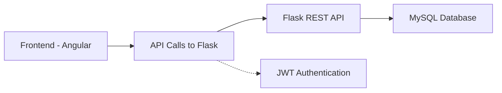

# 🏢 Full-Stack Developer Test — Flask API + MySQL + Angular

[](https://flask.palletsprojects.com/)
[](https://angular.io/)
[](https://www.mysql.com/)
[](https://jwt.io/)
[](LICENSE)

---

## 🎯 Objective

Build a **full-stack application** integrating a **Flask REST API** with an **Angular frontend**, implementing:

* 🔐 Role-based authentication (Admin / Super Admin)
* 🧑‍💼 Admin management with search & pagination
* 🏘️ Residential complexes & buildings management
* ⚡ Clean architecture with **repository pattern** & **SQLAlchemy ORM**

---

## 🌈 Tech Stack Timeline



* **Frontend:** Angular + Angular Material, responsive UI, route guards
* **Backend:** Flask, SQLAlchemy, JWT auth, repository pattern
* **Database:** MySQL
* **Tools:** Postman, Git, VSCode

---

## 🚀 Features

### **Backend**

* 🔑 **Authentication**

  * POST `/login` with email/password
  * JWT token generation & validation
  * Role-based access control (Admin vs Super Admin)
* 🧑‍💼 **Admins**

  * GET `/admins` — search & pagination
  * POST `/admins` — Super Admin only
  * Fields: Civility, Name, Email (unique), Phone, Role, Status, Password
* 🏘️ **Residential Complexes**

  * GET `/complexes` & POST `/complexes`
  * Auto-create Residential Complex Admin
* 🏢 **Buildings**

  * GET `/buildings`, POST `/buildings`, DELETE `/buildings/:id`
  * Linked to residential complexes
  * Auto-create Building Admin

---

### **Frontend**

* 🔑 **Authentication Module**

  * Login page, JWT token management, route guards
* 🧑‍💼 **Admin Management**

  * List admins (searchable/paginated)
  * Add admin (Super Admin only)
  * View details
* 🏘️ **Residential Complex Management**

  * List & create complexes
  * View complex details + associated buildings
* 🏢 **Building Management**

  * List & filter buildings by complex
  * Create & delete building
* 📱 **UI Features**

  * Angular Material
  * Responsive design
  * Role-based UI rendering

---

## 📂 Project Structure

```
backend/       # Flask API
├── app/
│   ├── models.py
│   ├── repositories/
│   ├── routes/
│   └── utils/
frontend/      # Angular App
├── src/
│   ├── app/
│   │   ├── auth/
│   │   ├── admins/
│   │   ├── complexes/
│   │   └── buildings/
└── angular.json
```

---

## 🏗️ Running the Project

### **Backend**

```bash
cd backend
pip install -r requirements.txt
# Configure MySQL in config.py
python run.py
```

### **Frontend**

```bash
cd frontend
npm install
ng serve
# Access at http://localhost:4200
```

---

## 🖼️ Demo GIF / Screenshots


*Replace with your own demo GIF showing login → dashboard → CRUD flow*

---

## 📌 Postman Collection

Test all endpoints:

* Authentication
* Admin CRUD
* Residential Complex CRUD
* Building CRUD

---

## 💡 Future Enhancements

* Add unit & e2e tests
* Improve UI styling & UX
* Dockerize backend & frontend
* Real-time notifications for admin actions
* Expand role-based features

---

## 📌 Author

**Alaa Asaad** — Full-Stack Developer
[GitHub](https://github.com/yourusername) | [LinkedIn](https://linkedin.com/in/yourprofile)

---
